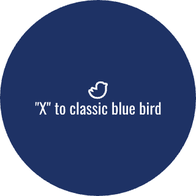

# Old Twitter Bird Extension 🐦🕊️

## Description

The "Old Twitter Bird Extension" is a Chrome extension that replaces the new Twitter "x" logo with the classic Twitter bird icon, bringing back the nostalgia of the early days of Twitter. This fun and lighthearted extension adds a touch of vintage charm to your Twitter browsing experience.

## Features

- Replaces the new Twitter "x" logo with the iconic Twitter bird icon.
- Enhances your Twitter feed with a fun and nostalgic touch.
- Secure and transparent extension with no data collection or external dependencies.

## Installation

1. Download the extension from the Chrome Web Store: [Link to Chrome Web Store page]
2. Click on the "Add to Chrome" button to install the extension.
3. Enjoy the trip down memory lane with the classic Twitter bird icon!

## Screenshots

## Disclaimer

This extension is purely for entertainment purposes and not endorsed by Twitter or its parent company. Use it at your own risk. The extension does not collect any user data and adheres to the Chrome Web Store policies.

## Feedback and Contributions

Feedback, bug reports, and contributions are welcome! Feel free to open an issue or submit a pull request to help improve the "Old Twitter Bird Extension."

## License

This project is licensed under the [MIT License](LICENSE).
